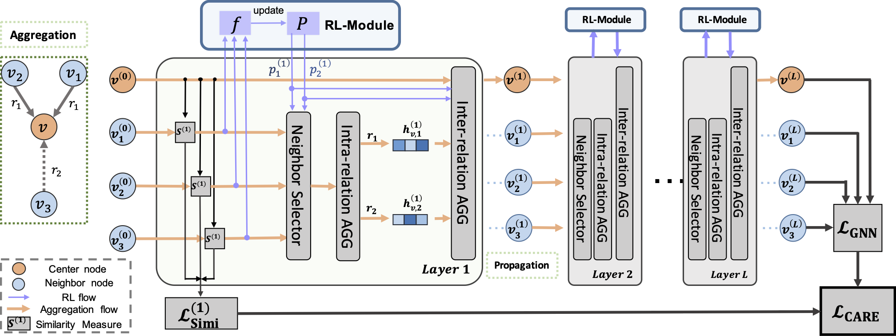

# CARE-GNN — Spam Review Detection on YelpChi

A PyTorch implementation of **CARE-GNN** applied to **YelpChi spam review detection**.

> Paper: [Enhancing Graph Neural Network-based Fraud Detectors against Camouflaged Fraudsters](https://arxiv.org/pdf/2008.08692.pdf) (CIKM 2020)  
> Authors: Yingtong Dou, Zhiwei Liu, Li Sun, Yutong Deng, Hao Peng, Philip S. Yu  
> Original repo: https://github.com/YingtongDou/CARE-GNN

---

## Overview

<p align="center">
    
</p>

**CARE-GNN** (Camouflage-Resistant Graph Neural Network) phát hiện spam review thông qua 3 module:

1. **Label-aware Similarity** — Lọc neighbor "ngụy trang" dựa trên khoảng cách label-score
2. **Similarity-aware Neighbor Selector** — Top-p sampling + Reinforcement Learning tự điều ngưỡng
3. **Relation-aware Aggregator** — Tổng hợp thông tin từ 3 quan hệ đồ thị với trọng số thích ứng

### YelpChi Graph Relations

| Quan hệ | Ý nghĩa | Ghi chú |
|---------|---------|---------|
| **R-U-R** | Hai review cùng một user | Bắt hành vi bot/spammer |
| **R-T-R** | Hai review nội dung tương tự | Bắt copy-paste spam |
| **R-S-R** | Hai review cùng điểm sao | Bắt "đánh bom sao" |

---

## Cấu trúc project

```
CARE-GNN/
├── data/
│   ├── YelpChi.zip              ← Dataset (giải nén trước khi chạy)
│   └── *.pickle                 ← Sinh bởi data_process.py
├── docs/
│   └── report.md                ← Tài liệu chi tiết (dataset, model, kết quả)
├── results/                     ← Sinh bởi train.py
│   ├── class_distribution.png
│   ├── precision_recall_curve.png
│   ├── tsne_embeddings.png
│   ├── training_curve.png
│   └── case_study.txt
├── data_process.py  ← Bước 1: tạo adjacency lists từ YelpChi.mat
├── train.py         ← Bước 2: train + visualize toàn bộ
├── model.py         ← OneLayerCARE model
├── layers.py        ← IntraAgg, InterAgg, RLModule
├── graphsage.py     ← GraphSAGE baseline
├── utils.py         ← Data loading, metrics
├── visualize.py     ← PR curve, t-SNE, training curve, case study
└── simi_comp.py     ← Phân tích Feature/Label similarity
```

---

## Cài đặt

```bash
git clone <repo-url>
cd CARE-GNN
pip install -r requirements.txt
```

**Yêu cầu:** Python >= 3.6, PyTorch >= 1.4

---

## Chạy thực nghiệm

```bash
# Bước 1: Giải nén dataset
cd data && unzip YelpChi.zip && cd ..

# Bước 2: Tạo adjacency lists (chạy 1 lần)
python data_process.py

# Bước 3: Train CARE-GNN + sinh tất cả visualizations
python train.py

# Tùy chọn: Chạy GraphSAGE baseline
python train.py --model SAGE

# Tùy chọn: Tắt class weighting
python train.py --no-class-weight
```

Kết quả (biểu đồ + case study) được lưu tự động vào `results/`.

---

## Kết quả trên YelpChi

| Module | AUC | Recall (Macro) |
|--------|-----|----------------|
| Simi Label | ~0.886 | ~0.813 |
| **CARE-GNN** | **~0.923** | **~0.872** |

> Xem `docs/report.md` để biết phân tích chi tiết, mô tả dataset, kiến trúc model và case study.

---

## Citation

```bibtex
@inproceedings{dou2020enhancing,
  title={Enhancing Graph Neural Network-based Fraud Detectors against Camouflaged Fraudsters},
  author={Dou, Yingtong and Liu, Zhiwei and Sun, Li and Deng, Yutong and Peng, Hao and Yu, Philip S},
  booktitle={Proceedings of the 29th ACM International Conference on Information and Knowledge Management (CIKM'20)},
  year={2020}
}
```
