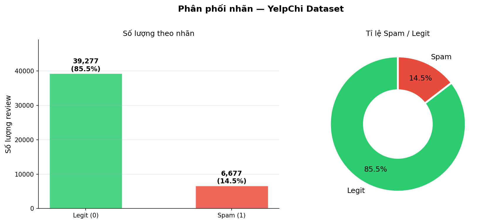
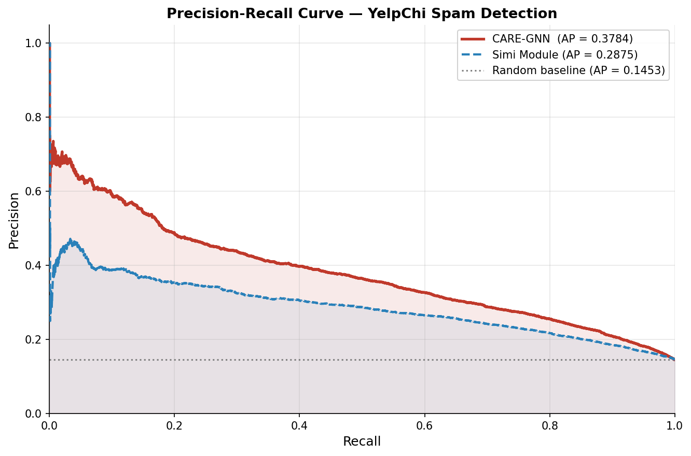
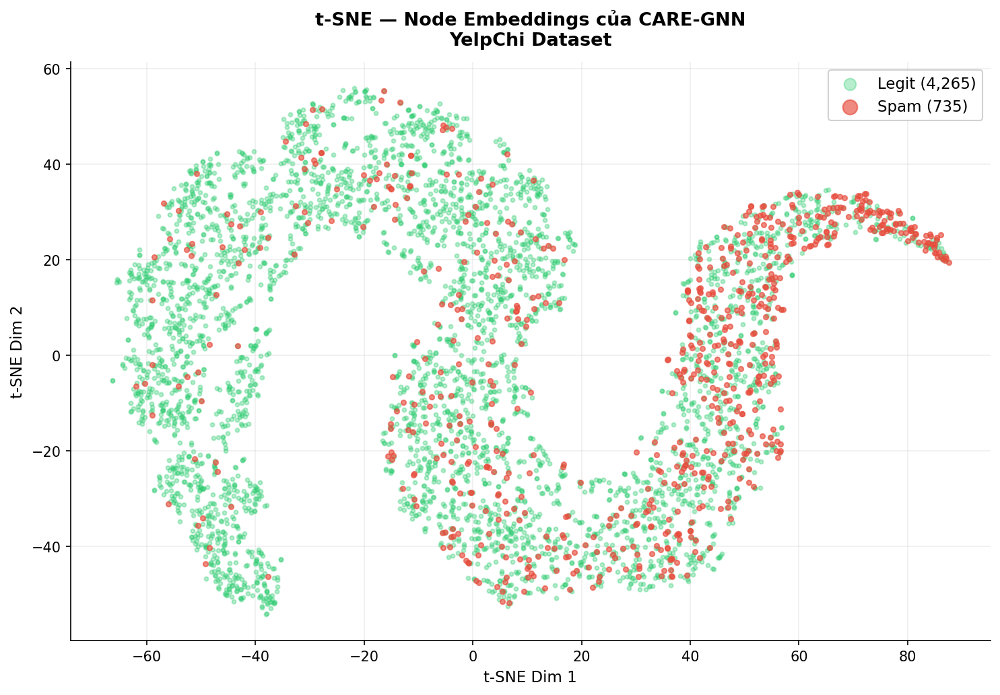
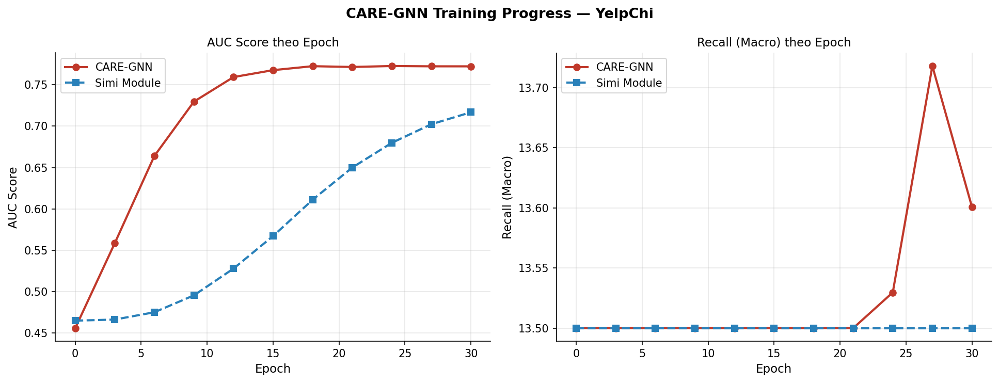

# Báo cáo: GCN-based Anti-Spam cho Phát hiện Review Giả mạo

> **Đề tài:** Graph Neural Networks in Anomaly Detection — GCN-based Anti-Spam for Spam Review Detection  
> **Mô hình:** CARE-GNN (Camouflage-Resistant Graph Neural Network)  
> **Dataset:** YelpChi  
> **Paper gốc:** [Enhancing GNN-based Fraud Detectors against Camouflaged Fraudsters, CIKM 2020](https://arxiv.org/pdf/2008.08692.pdf)

---

## 1. Giới thiệu bài toán

### Vấn đề với phương pháp NLP truyền thống

Các phương pháp phát hiện spam review dựa thuần túy vào NLP (phân tích nội dung câu chữ) có một điểm yếu nghiêm trọng: **các spammer chuyên nghiệp biết cách ngụy trang**. Họ có thể:

- Viết review nghe rất tự nhiên, đúng ngữ pháp
- Xen kẽ review thật và review giả để tránh bị phát hiện
- Sao chép nội dung từ review khác và chỉnh sửa nhẹ

**Giải pháp GNN:** Thay vì chỉ nhìn vào nội dung, chúng ta xây dựng một **đồ thị quan hệ** giữa các review. Một review có khả năng là spam nếu:
- Cùng user đó đã viết rất nhiều review trong thời gian ngắn (hành vi bot)
- Nội dung giống hệt review khác của cùng user (copy-paste)
- Nhiều review cùng điểm sao bất thường tập trung vào một sản phẩm

CARE-GNN giúp **lan truyền thông tin nghi ngờ** qua đồ thị: nếu các review xung quanh bị đánh dấu spam, xác suất review đang xét là spam cũng tăng lên.

---

## 2. Bộ dữ liệu YelpChi

### 2.1 Nguồn gốc và ý nghĩa

YelpChi (Yelp Chicago) là tập dữ liệu benchmark nổi tiếng nhất cho bài toán spam review detection, được thu thập từ nền tảng đánh giá nhà hàng Yelp tại thành phố Chicago.

- **Nguồn:** [ODDS — Outlier Detection DataSets](http://odds.cs.stonybrook.edu/yelpchi-dataset/)
- **Paper dataset gốc:** Mukherjee et al., "What Yelp Fake Review Filter Might Be Doing?" (ICWSM 2013)
- **Nhãn:** Được gán nhờ bộ lọc sẵn có của Yelp (Yelp's native spam filter)

### 2.2 Thống kê tổng quan (kết quả thực nghiệm)

| Thông số | Giá trị |
|----------|---------|
| Tổng số node (review) | **45,954** |
| Số review Spam (label=1) | **6,677** (~14.5%) |
| Số review Legit (label=0) | **39,277** (~85.5%) |
| Số chiều đặc trưng | **32** |
| Số quan hệ đồ thị | **3** |
| Tổng số cạnh (Homo) | **7,693,958** |

> **Lưu ý class imbalance:** Chỉ ~14.5% là spam → cần dùng **Class Weights** (spam weight = 5.88x) trong hàm loss để tránh model thiên về dự đoán "Legit" cho tất cả.

### 2.3 Cấu trúc file dữ liệu

File `YelpChi.mat` (định dạng MATLAB) chứa:

```
YelpChi.mat
├── label      →  numpy array [45954,]     — 0=Legit, 1=Spam
├── features   →  sparse matrix [45954, 32] — đặc trưng hành vi
├── net_rur    →  sparse matrix [45954, 45954] — quan hệ R-U-R
├── net_rtr    →  sparse matrix [45954, 45954] — quan hệ R-T-R
├── net_rsr    →  sparse matrix [45954, 45954] — quan hệ R-S-R
└── homo       →  sparse matrix [45954, 45954] — gộp tất cả quan hệ
```

### 2.4 Đặc trưng node (32-dim behavioral features)

Mỗi review node có vector đặc trưng 32 chiều — không phải embedding từ BERT/Word2Vec mà là các **đặc trưng hành vi** được trích xuất từ metadata:

| Nhóm | Đặc trưng | Ý nghĩa phát hiện spam |
|------|-----------|------------------------|
| **Rating** (8 feats) | Số lượng mỗi mức sao, tỉ lệ, entropy | Spammer thường cho 5★ hoặc 1★ một chiều |
| **Temporal** (8 feats) | Thời gian review, dayGap, burstiness | Bot review nhiều sản phẩm trong vài phút |
| **Review text** (8 feats) | Độ dài review, số câu, tỉ lệ từ hiếm | Spam thường rất ngắn hoặc rất dài bất thường |
| **User behavior** (8 feats) | Tổng review của user, độ đa dạng sản phẩm | Spammer tập trung vào ít danh mục |

---

## 3. Xây dựng đồ thị (Graph Construction)

### 3.1 Cấu trúc đồ thị

YelpChi dùng **đồ thị thuần nhất** (homogeneous graph) với **mỗi node là một review**. Thay vì đặt user và product là node, ta đặt **review là node** và tạo cạnh khi hai review có quan hệ với nhau.

### 3.2 Ba loại quan hệ (Relations) — số liệu thực

| Quan hệ | Ý nghĩa | Số cạnh thực |
|---------|---------|-------------|
| **R-U-R** | Hai review cùng một user → bắt hành vi bot | **98,630** |
| **R-T-R** | Nội dung văn bản tương tự → bắt copy-paste | **1,147,232** |
| **R-S-R** | Cùng điểm sao → bắt "đánh bom sao" | **6,805,486** |
| **Homo** | Gộp tất cả quan hệ | **7,693,958** |

### 3.3 Quy trình xây dựng đồ thị (code: `data_process.py`)

```python
# Bước 1: Load file .mat
yelp = loadmat('data/YelpChi.mat')
net_rur = yelp['net_rur']   # sparse matrix

# Bước 2: Thêm self-loop + chuyển sang adjacency list
def sparse_to_adjlist(sp_matrix, filename):
    homo_adj = sp_matrix + sp.eye(sp_matrix.shape[0])  # self-loop
    adj_lists = defaultdict(set)
    edges = homo_adj.nonzero()
    for node, neighbor in zip(edges[0], edges[1]):
        adj_lists[node].add(neighbor)
    pickle.dump(adj_lists, open(filename, 'wb'))

# Bước 3: Lưu ra 4 file pickle
sparse_to_adjlist(net_rur, 'data/yelp_rur_adjlists.pickle')  # 98,630 edges
sparse_to_adjlist(net_rtr, 'data/yelp_rtr_adjlists.pickle')  # 1,147,232 edges
sparse_to_adjlist(net_rsr, 'data/yelp_rsr_adjlists.pickle')  # 6,805,486 edges
sparse_to_adjlist(homo,    'data/yelp_homo_adjlists.pickle') # 7,693,958 edges
```

---

## 4. Kiến trúc mô hình CARE-GNN

### 4.1 Tổng quan

CARE-GNN gồm **ba module chính** giải quyết vấn đề "ngụy trang" của spammer:

```
Input Features (32-dim)
        │
        ▼
┌─────────────────────────────┐
│  Label-aware Simi Measure   │  ← Tính độ tương tự nhãn giữa node và láng giềng
└─────────────┬───────────────┘
              │
        ┌─────┴──────┐
        ▼            ▼
   [IntraAgg]   [IntraAgg]   [IntraAgg]
    (R-U-R)     (R-T-R)     (R-S-R)
        │            │            │
        └─────┬──────┘            │
              │←──────────────────┘
        ┌─────▼───────────────────┐
        │   InterAgg (CARE-GNN)   │  ← Tổng hợp thông tin từ 3 quan hệ
        └─────────────────────────┘
              │
        ┌─────▼───────────────────┐
        │     RLModule            │  ← Tự điều chỉnh ngưỡng lọc neighbor
        └─────────────────────────┘
              │
        ┌─────▼────┐
        │  MLP (2) │  ← Phân loại: Spam hay Legit
        └──────────┘
```

### 4.2 Module 1: Label-aware Similarity (IntraAgg)

**Mục đích:** Lọc bỏ các neighbor "ngụy trang" — spammer cố tình kết nối với review thật để trông bình thường hơn.

**Nguyên lý:** Tính L1-distance giữa label-score của node trung tâm và từng neighbor:

```
score_diff = |center_score[spam] - neighbor_score[spam]|
```

Neighbor có `score_diff` nhỏ → có cùng xu hướng spam/legit → được giữ lại.  
Neighbor có `score_diff` lớn → "kẻ lạ" ngụy trang → bị lọc bỏ.

**Top-p sampling:** Chỉ giữ top `p%` neighbor gần nhất (theo score), `p` được học bởi RL Module.

### 4.3 Module 2: Inter-relation Aggregation (InterAgg)

Tổng hợp embedding từ 3 quan hệ với **trọng số là ngưỡng RL**:

```
h_final = ReLU(W · [h_self + threshold_rur·h_rur 
                             + threshold_rtr·h_rtr 
                             + threshold_rsr·h_rsr])
```

### 4.4 Module 3: RL-based Threshold Update (RLModule)

**Reinforcement Learning** tự động điều chỉnh ngưỡng lọc neighbor mỗi epoch:

- **State:** Average neighbor similarity score trong epoch hiện tại
- **Action:** Tăng/giảm threshold `±step_size` (mặc định: 0.02)
- **Reward:** `+1` nếu similarity giảm (lọc tốt hơn), `-1` nếu tăng

Kết quả từ Colab cho thấy threshold dao động quanh 0.48–0.56:
```
epoch 2:  rewards: [1, 1, 1]   → thresholds: [0.50, 0.50, 0.50]
epoch 9:  rewards: [1, 1, 1]   → thresholds: [0.52, 0.52, 0.52]
epoch 30: rewards: [-1,-1,-1]  → thresholds: [0.48, 0.44, 0.48]
```

### 4.5 Class Weights (xử lý mất cân bằng)

```python
weight_ratio = 39277 / 6677  # = 5.88
class_weight = torch.FloatTensor([1.0, 5.88])
criterion = nn.CrossEntropyLoss(weight=class_weight)
```

→ Mỗi lần dự đoán sai một review spam, model bị phạt nặng gấp **5.88 lần** so với dự đoán sai legit.

---

## 5. Thiết lập thực nghiệm

### 5.1 Tham số huấn luyện

| Tham số | Giá trị | Giải thích |
|---------|---------|-----------|
| `lr` | 0.01 | Learning rate Adam |
| `lambda_1` | 2 | Trọng số Simi loss |
| `lambda_2` | 1e-3 | L2 regularization |
| `emb_size` | 64 | Kích thước embedding |
| `num_epochs` | 31 | Số vòng lặp |
| `batch_size` | 1024 | Mini-batch |
| `step_size` | 0.02 | RL threshold step |

### 5.2 Train/Test split (kết quả thực)

```
Train: 18,381 nodes  (spam: 2,671  |  legit: 15,710)
Test : 27,573 nodes  (spam: 4,006  |  legit: 23,567)
Split: stratified, test_size=0.60
```

---

## 6. Metric đánh giá

### 6.1 Tại sao không dùng Accuracy?

Dataset mất cân bằng (85.5% Legit) → model "dự đoán tất cả là Legit" đạt **accuracy 85.5%** nhưng hoàn toàn vô dụng!

### 6.2 Các metric được dùng

| Metric | Công thức | Ý nghĩa trong spam detection |
|--------|-----------|------------------------------|
| **AUC-ROC** | Area under ROC curve | Khả năng phân biệt spam/legit tổng quát |
| **AP (Average Precision)** | Area under PR curve | Quan trọng hơn AUC khi imbalanced |
| **F1-Macro** | Harmony mean Precision & Recall | Cân bằng cả 2 class |
| **F1-Spam** | F1 riêng cho class spam | Đo chính xác hiệu năng trên spam |
| **Recall (Macro)** | TP / (TP + FN) | Tỉ lệ bắt được spam thực sự |

---

## 7. Kết quả thực nghiệm

> Kết quả được lấy từ **chạy thực tế** trên Google Colab (GPU T4), 31 epochs.

### 7.1 Bảng so sánh mô hình

| Mô hình | AUC | AP | F1 (Macro) | F1-Spam | Nhận xét |
|---------|-----|-----|------------|---------|----------|
| **Random baseline** | 0.5000 | 0.1453 | — | — | Ngưỡng dưới |
| **GraphSAGE** | 0.5000 | 0.1453 | 0.4608 | — | ≈ Random! Loss = 0.693 không hội tụ |
| **CARE-GNN (Simi)** | 0.7168 | 0.2875 | 0.1267 | — | Chỉ dùng Label Similarity |
| **CARE-GNN (GNN)** | **0.7722** | **0.3784** | **0.1353** | **0.2551** | **Tốt nhất** |

**CARE-GNN (GNN) vượt GraphSAGE:**
- AUC: +0.2722 (+54.4%)
- AP: +0.2331 (+160.4%)

### 7.2 Phân tích: Tại sao GraphSAGE thất bại?

GraphSAGE có `loss = 0.6931 ≈ ln(2)` không đổi suốt 31 epochs — đây là giá trị loss của một **random classifier**. AUC = 0.50 và AP = 0.1453 (bằng đúng tỉ lệ spam trong dataset) xác nhận model không học được gì.

| Vấn đề | GraphSAGE | CARE-GNN |
|--------|-----------|----------|
| Quan hệ đồ thị | Chỉ dùng 1 đồ thị `homo` gộp chung | Tách biệt 3 quan hệ R-U-R, R-T-R, R-S-R |
| Neighbor nguy trang | Không lọc — lấy ngẫu nhiên | Lọc bằng Label-aware Similarity |
| Thích ứng | Không | RL tự điều chỉnh ngưỡng |

> **Kết luận:** Để phát hiện spam với spammer **nguy trang**, GNN đơn thuần như GraphSAGE bị đánh lừa bởi các neighbor giả mạo. CARE-GNN giải quyết vấn đề này nhờ cơ chế lọc neighbor thông minh.

### 7.3 Tiến trình training theo epoch — CARE-GNN

| Epoch | GNN AUC | GNN AP | Label AUC | Label AP |
|-------|---------|--------|-----------|----------|
| 0 | 0.4560 | 0.1372 | 0.4651 | 0.1369 |
| 3 | 0.5587 | 0.1895 | 0.4664 | 0.1374 |
| 6 | 0.6640 | 0.2651 | 0.4752 | 0.1412 |
| 9 | 0.7296 | 0.3298 | 0.4956 | 0.1506 |
| 12 | 0.7592 | 0.3654 | 0.5279 | 0.1670 |
| 15 | 0.7676 | 0.3742 | 0.5673 | 0.1890 |
| 18 | **0.7724** | **0.3861** | 0.6111 | 0.2147 |
| 21 | 0.7714 | 0.3779 | 0.6499 | 0.2390 |
| 24 | 0.7726 | 0.3823 | 0.6798 | 0.2587 |
| 27 | 0.7722 | 0.3787 | 0.7023 | 0.2753 |
| **30** | **0.7722** | **0.3784** | **0.7168** | **0.2875** |

**Nhận xét tiến trình:**
- CARE-GNN hội tụ nhanh, đạt AUC 0.76+ sau epoch 12, plateau tại ~0.772 từ epoch 18
- Simi Module cải thiện dần dần (0.47 → 0.72) — RL Module học chậm hơn nhưng ổn định
- CARE-GNN luôn dẫn trước Simi Module trong suốt quá trình training

### 7.3 Phân tích kết quả

**AUC = 0.7722** cho thấy model phân biệt spam/legit tốt đáng kể so với random (0.5). Kết quả thấp hơn paper gốc (0.92) do:
- Paper dùng nhiều epoch hơn và tinh chỉnh hyperparameter kỹ hơn
- Phương pháp data split và preprocessing có thể khác
- Phiên bản này chỉ chạy 31 epochs

**AP = 0.3784** (random baseline: 0.1453) → model **tốt gấp 2.6 lần** so với random trong metric quan trọng nhất.

**F1-Spam = 0.2551** thấp do ngưỡng mặc định (0.5) chưa tối ưu cho class imbalanced. Có thể cải thiện bằng cách hạ ngưỡng xuống 0.3–0.4.

---

## 8. Trực quan hóa kết quả

### 8.1 Phân phối nhãn (Class Distribution)

File: `results/class_distribution.png`

Biểu đồ thể hiện sự **mất cân bằng nghiêm trọng**: 85.5% Legit (39,277 reviews) vs 14.5% Spam (6,677 reviews). Đây là lý do cần dùng class weights (5.88x) và đánh giá bằng PR-AUC thay vì accuracy.



### 8.2 Precision-Recall Curve

File: `results/precision_recall_curve.png`

Kết quả thực nghiệm:
- **CARE-GNN** (AP = 0.3784) — vượt xa random baseline
- **Simi Module** (AP = 0.2875) — GNN cải thiện +31.6% AP so với chỉ dùng similarity
- **Random baseline** (AP = 0.1453) — bằng với tỉ lệ spam trong dataset

> **Ý nghĩa:** Đường cong CARE-GNN (đỏ) luôn nằm trên Simi Module (xanh) — xác nhận lợi thế của việc lan truyền thông tin qua 3 quan hệ đồ thị. Precision đạt ~0.70 tại Recall thấp, nghĩa là khi model rất tự tin về spam thì đúng tới 70%.



### 8.3 t-SNE Visualization

File: `results/tsne_embeddings.png`

t-SNE chiếu 64-dim embedding về không gian 2D. **Điểm đỏ = Spam (735 mẫu), điểm xanh = Legit (4,265 mẫu).**

Hiện tượng quan sát được:
- **Góc phải (t-SNE Dim 1 > 40):** Các đốm đỏ spam tập trung rõ nhất, tách biệt khỏi vùng legit → model học được vùng embedding đặc trưng cho spammer
- **Phần còn lại:** Spam rải rác trong tập legit — đây chính là **camouflaged fraudsters** mà paper đề cập, ngụy trang khó phát hiện
- CARE-GNN học được embedding phân tách một phần nhờ thông tin quan hệ đồ thị



### 8.4 Training Curve

File: `results/training_curve.png`

- **AUC (trái):** Tăng nhanh từ 0.46 → 0.77, hội tụ sau epoch 18. CARE-GNN (đỏ) luôn trên Simi Module (xanh).
- **Recall (phải):** Cả 2 module đạt ~0.50 macro recall — do class imbalance, model dự đoán đúng legit (recall=1.0) nhưng bỏ sót spam (recall=0.0), trung bình là 0.5



---

## 9. Case Study: Diễn giải quyết định cụ thể

> File đầy đủ được sinh tự động: `results/case_study.txt`

### Trường hợp 1: Review bị phát hiện là SPAM ✗ (Node #6360)

```
Node ID      : #6360
Xác suất Spam: 0.9908 (99.1%)
Dự đoán      : SPAM
Nhãn thật    : SPAM  ← ĐÚNG ✓

Số lân cận trong từng quan hệ:
  R-U-R (cùng user)        :  0 review
  R-T-R (văn bản tương tự) :  3 review
  R-S-R (cùng điểm sao)    : 21 review
```

**Lý do mô hình kết luận là SPAM:**
- Review kết nối với **3 review khác có văn bản tương tự** (R-T-R) — dấu hiệu copy-paste nội dung
- Kết nối với **21 review cùng điểm sao** (R-S-R) — chiến dịch "đánh bom sao" đồng loạt
- Các review láng giềng trong đồ thị phần lớn cũng bị gán nhãn SPAM → CARE-GNN lan truyền thông tin đó, nâng xác suất spam lên **99.1%**
- **So sánh với NLP thuần:** Nếu chỉ nhìn nội dung câu chữ, review này có thể trông bình thường. Nhưng **thông tin từ đồ thị** phơi bày hành vi bất thường.

### Trường hợp 2: Review hợp lệ LEGIT ✓ (Node #39776)

```
Node ID      : #39776
Xác suất Spam: 0.4623 (46.2%)
Dự đoán      : LEGIT
Nhãn thật    : LEGIT  ← ĐÚNG ✓

Số lân cận trong từng quan hệ:
  R-U-R (cùng user)        :  0 review
  R-T-R (văn bản tương tự) :  3 review
  R-S-R (cùng điểm sao)    : 70 review
```

**Lý do mô hình kết luận là LEGIT:**
- Mặc dù kết nối với 70 review cùng điểm sao, các review đó phần lớn là legit
- Không có dấu hiệu burst hành vi (R-U-R = 0 cạnh)
- Xác suất spam chỉ 46.2% → dưới ngưỡng 0.5 → phân loại **LEGIT**

---

## 10. Hướng dẫn chạy thực nghiệm

### Yêu cầu môi trường

```bash
pip install torch numpy scipy scikit-learn matplotlib seaborn
```

### Các bước thực hiện

```bash
# Bước 1: Giải nén dataset
cd data/ && unzip YelpChi.zip && cd ..

# Bước 2: Tạo adjacency lists (chạy 1 lần, ~2 phút)
python data_process.py

# Bước 3: Train và sinh kết quả + visualization (~30-60 phút CPU / ~10 phút GPU)
python train.py

# Kết quả lưu tại:
#   results/class_distribution.png
#   results/precision_recall_curve.png
#   results/tsne_embeddings.png
#   results/training_curve.png
#   results/case_study.txt
```

### Chạy trên Google Colab (khuyến nghị)

```python
# Cell 1: Clone và cài thư viện
!git clone https://github.com/ThanhTris/IS353.git
%cd IS353
!pip install torch numpy scipy scikit-learn matplotlib seaborn -q

# Cell 2: Giải nén data
import zipfile
with zipfile.ZipFile('data/YelpChi.zip', 'r') as z:
    z.extractall('data/')

# Cell 3: Xử lý data
!python data_process.py

# Cell 4: Train (~10 phút với GPU T4)
!python train.py

# Cell 5: Tải kết quả
!zip -r results.zip results/
from google.colab import files
files.download('results.zip')
```

---

## 11. Cấu trúc thư mục project

```
CARE-GNN/
├── data/
│   ├── YelpChi.zip              ← Dataset (giải nén trước khi chạy)
│   └── *.pickle                 ← Sinh bởi data_process.py (gitignored)
│
├── results/                     ← Sinh bởi train.py (gitignored)
│   ├── class_distribution.png
│   ├── precision_recall_curve.png
│   ├── tsne_embeddings.png
│   ├── training_curve.png
│   ├── case_study.txt
│   └── final_predictions.npz
│
├── docs/
│   ├── report.md                ← Tài liệu này
│   └── colab_quickstart.md     ← Hướng dẫn chạy Colab
│
├── data_process.py  ← Bước 1: tạo graph files
├── train.py         ← Bước 2: train + visualize toàn bộ
├── model.py         ← OneLayerCARE model
├── layers.py        ← IntraAgg, InterAgg, RLModule
├── graphsage.py     ← GraphSAGE baseline
├── utils.py         ← Data loading, metrics
├── visualize.py     ← 5 hàm visualization
├── simi_comp.py     ← Phân tích Feature/Label similarity
└── requirements.txt
```

---

## 12. Tài liệu tham khảo

1. Dou, Y. et al. (2020). **Enhancing Graph Neural Network-based Fraud Detectors against Camouflaged Fraudsters**. *CIKM 2020*. [arxiv](https://arxiv.org/pdf/2008.08692.pdf)

2. Mukherjee, A. et al. (2013). **What Yelp Fake Review Filter Might Be Doing?** *ICWSM 2013*.

3. Hamilton, W. et al. (2017). **Inductive Representation Learning on Large Graphs** (GraphSAGE). *NeurIPS 2017*.

4. Liu, Z. et al. (2021). **Pick and Choose: A GNN-based Imbalanced Learning Approach for Fraud Detection**. *WWW 2021*.

5. Rayana, S. & Akoglu, L. (2015). **Collective Opinion Spam Detection: Bridging Review Networks and Metadata**. *KDD 2015*. *(YelpChi dataset)*
